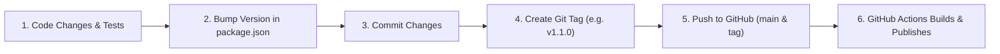

# ViewFlux Desktop — Release & Versioning Guide

This guide walks you through releasing new versions of **ViewFlux Desktop** step by step. Thanks to the GitHub Actions CI/CD setup in [`.github/workflows/build.yml`](file:///c:/Users/riddh/Documents/projects/viewflux-desktop/.github/workflows/build.yml), you do not need to build Linux or macOS binaries on your local Windows PC—GitHub builds and uploads all installers automatically when you push a version tag.

---

## 1. Release Lifecycle Overview



---

## 2. Step-by-Step Instructions

### Step 1: Verify Code & Typechecks
Before bumping the version, make sure your code compiles cleanly and has no TypeScript or syntax issues:

```powershell
npm run typecheck
```

*(Optional local test)* If you want to confirm the Windows packaging locally before pushing:
```powershell
npm run dist:win
```

---

### Step 2: Bump the Version Number
Open [`package.json`](file:///c:/Users/riddh/Documents/projects/viewflux-desktop/package.json) and update the `"version"` string following **Semantic Versioning** (`MAJOR.MINOR.PATCH`):

- **Patch (`1.0.1`)**: Small bug fixes, tweaks, CSS fixes.
- **Minor (`1.1.0`)**: New features or pages, backward-compatible additions.
- **Major (`2.0.0`)**: Major redesign, breaking architecture or storage schema shifts.

Example in [`package.json`](file:///c:/Users/riddh/Documents/projects/viewflux-desktop/package.json#L3):
```json
{
  "name": "viewflux-desktop",
  "version": "1.1.0",
  ...
}
```

---

### Step 3: Commit the Changes
Stage and commit all your modified files along with the updated `package.json`:

```powershell
git add .
git commit -m "feat: description of new features and bump version to 1.1.0"
```

---

### Step 4: Create a Git Release Tag
Tags tell GitHub Actions that this commit represents an official release. Prefix tag numbers with `v`:

```powershell
git tag -a v1.1.0 -m "Release v1.1.0: Summary of key changes"
```

> [!TIP]
> If you ever make a mistake on a tag before pushing, delete it locally using:
> `git tag -d v1.1.0`

---

### Step 5: Push Commit and Tags to GitHub
Push both your branch and the new tag to GitHub:

```powershell
git push origin main
git push origin v1.1.0
```

*(Or push both simultaneously)*:
```powershell
git push origin main --tags
```

---

### Step 6: Automated Multi-Platform Build & Publish
Once pushed, GitHub Actions immediately takes over:

1. **Matrix Build**:
   - `windows-latest`: Builds `ViewFlux-Setup-1.1.0.exe`
   - `ubuntu-latest`: Builds `ViewFlux-Linux-1.1.0-amd64.deb` & `ViewFlux-Linux-1.1.0-x86_64.AppImage`
   - `macos-latest`: Builds `ViewFlux-mac-1.1.0-arm64.dmg`, `ViewFlux-mac-1.1.0-x64.dmg`, and `.zip` archives
2. **Auto-Publish**:
   - The workflow downloads all build artifacts and automatically attaches them to the new **GitHub Release** tagged `v1.1.0`.
   - Release notes are generated from your commit history.

You can monitor progress at:
`https://github.com/hihumanzone/ViewFlux/actions`

---

## 3. Quick Reference Cheatsheet

Whenever you're ready to deploy an update, run this block in PowerShell:

```powershell
# 1. Check code
npm run typecheck

# 2. Add and commit (replace 1.1.0 with your version)
git add .
git commit -m "feat: your changes summary and bump version to 1.1.0"

# 3. Tag
git tag -a v1.1.0 -m "Release v1.1.0"

# 4. Push to trigger multi-platform build
git push origin main --tags
```

---

## 4. Editing Release Notes on GitHub
After GitHub Actions finishes the release:
1. Go to `https://github.com/hihumanzone/ViewFlux/releases`.
2. Click the pencil icon (**Edit**) next to the new version.
3. Polish or customize the release description, highlight key additions, and click **Update release**.
