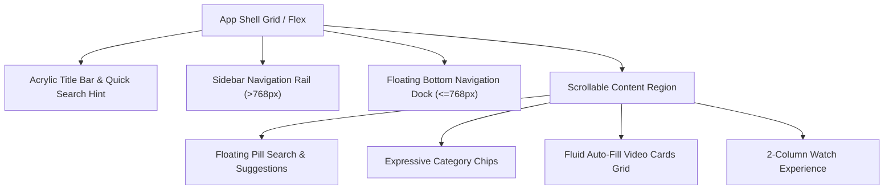

# Material 3 Expressive Frontend Refactor

ViewFlux Desktop has undergone a deep, extensive frontend UI/UX refactor adhering to **Material 3 Expressive** guidelines, incorporating the tactile, playful, and high-clarity patterns showcased in Google's design system.

---

## 1. Visual Design & Design System

### 1.1 Tonal Surface Architecture
Material 3 Expressive replaces flat neutral dark grays with a warm, luminous aubergine/plum chromatic surface hierarchy:

| Token | Hex Value | Role & Usage |
| :--- | :--- | :--- |
| `--bg` | `#0E0716` | Main viewport background |
| `--surface` | `#140B20` | Primary app shell & sidebars |
| `--surface-container-lowest` | `#0A0410` | Deepest recessed regions |
| `--surface-container-low` | `#13091E` | Inset panels, list backgrounds |
| `--surface-container` | `#1A0F28` | Standard cards, video tiles |
| `--surface-container-high` | `#221434` | Hover states, search fields, active tiles |
| `--surface-container-highest`| `#2C1A42` | Menus, popovers, slider tracks |
| `--surface-variant` | `#42295E` | Dividers, scrollbar thumbs, switches |

### 1.2 Dual Accent System
- **Primary Accent (`--primary: #D0BCFF`)**: Expressive Lavender / Lilac with high luminance on dark surfaces, accompanied by `--primary-container: #4F378B` and ambient glow `--primary-glow`.
- **Signature Tertiary Accent (`--tertiary: #FFA39E`)**: Expressive Coral / Peach, prominently featured in Material 3 Expressive references for high-emphasis CTAs, creator badges, and active state highlights.
- **Full Theme Palettes**: Expanded palettes for `purple`, `coral`, `blue`, `teal`, `green`, `amber`, `pink`, and `red`.

### 1.3 Expressive Radii & Shape Grammar
- **Pill Primitives (`--r-full: 9999px`)**: Buttons, search fields, filter chips, volume pods, and bottom navigation dock.
- **Card Containers (`--r-lg: 26px`, `--r-xl: 32px`)**: Video cards, creator cards, dialogs, and playback setting sheets.
- **Scalloped Rosette Geometry**: 16-point organic rosette badge for hero empty states and creator highlights.

### 1.4 Typography Hierarchy
- Modern font stack: `'Google Sans Flex', 'Roboto Flex', 'Inter', 'Segoe UI Variable Text', system-ui, -apple-system, sans-serif`.
- Tight headline tracking (`-0.025em`) and font-weight `800` for titles and section headings.
- Tabular numerals (`font-variant-numeric: tabular-nums`) for video durations, view counts, and time scrubbers.

---

## 2. Component Hierarchy & Modern Layout

### Key Component Upgrades:
1. **Search Experience**:
   - 52px floating capsule search bar with container tint and luminous primary glow focus ring.
   - Animated autocomplete suggestions popover with 24px rounded corners and backdrop blur.
   - 40px rounded full filter chips with category icons and active container fill.

2. **Video Cards**:
   - 26px rounded corners with subtle outline and hover lift (`translateY(-4px)` with `--shadow-2` and glow).
   - Frosted glass duration badge with tabular numbers.
   - Live stream badge with pulsating glowing red dot.
   - Dual-tone gradient progress bar across the bottom of the thumbnail.

3. **Watch Page**:
   - 2-column desktop composition (`1fr 380px`) with 28px gap.
   - Player with 26px rounded corners, floating bottom controls bar, and 48px circular play/pause button.
   - Creator bar featuring an expressive Peach/Coral CTA button (`Channel` / `Visit`).
   - Split segmented pill button for Like/Dislike with smooth divider.
   - Description card with interactive timestamp pills that jump and seek smoothly.

4. **Creator & Playlist Cards**:
   - Creator cards with 76px avatar ring, subscriber badges, and prominent action pill.
   - Playlist cards with multi-layer stacked depth affordance and duration badges.

---

## 3. Accessibility & WCAG Compliance

- **High Contrast Ratios**:
  - High-emphasis text (`--on-surface: #F7EEF9`): `15.8:1` contrast against background (exceeds WCAG AAA `7:1`).
  - Medium-emphasis text (`--on-surface-variant: #D5C3DC`): `8.2:1` contrast (exceeds WCAG AA `4.5:1`).
  - Primary interactive accents (`#D0BCFF` & `#FFA39E`): `9.4:1` contrast against surface.
- **Dual-Ring Focus Indicators**:
  - `outline: 2px solid var(--primary); outline-offset: 3px; box-shadow: 0 0 0 4px color-mix(in srgb, var(--primary) 30%, transparent);`
  - High visibility across all container depths for keyboard users.
- **Touch & Click Targets**:
  - All interactive buttons meet or exceed `44x44px` or `40x40px` touch target criteria.
- **Reduced Motion**:
  - Full `@media (prefers-reduced-motion: reduce)` support instantly zeroing all spring animations and transitions.

---

## 4. Mobile-First Responsive Breakpoints

| Breakpoint | Layout Behavior | Navigation Mode |
| :--- | :--- | :--- |
| **`> 1080px`** | Full sidebar (`232px`), 3–4 column video grid, 2-column watch page | Desktop expanded sidebar |
| **`769px – 1080px`** | Collapsible navigation rail (`78px`), 2–3 column video grid | Compact icon rail |
| **`<= 768px`** | Full width content (`padding-bottom: 96px`), 1–2 column cards | **Floating M3 Expressive Bottom Navigation Dock** |
| **`<= 540px`** | Single column video cards, stacked action buttons, full-width search | Floating bottom navigation capsule |
